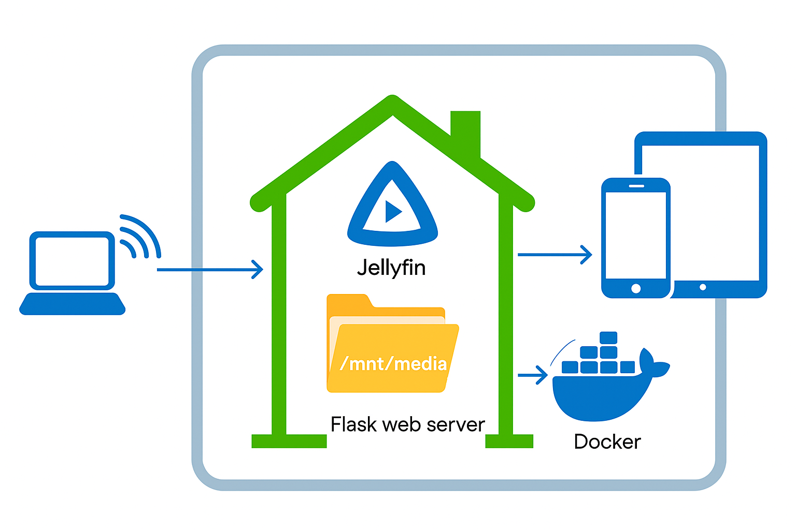

# Home Cloud Media Server

A complete Docker-based media server solution combining Jellyfin media server with a custom Flask media management web application. Designed for local home network use on Arch Linux adn Debian.

## Architecture



## 🌟 Features

### Flask Media Manager
- **User Authentication**: Secure login system with admin controls
- **Multi-format Upload**: Support for images (JPG, PNG, GIF, WebP), videos (MP4, AVI, MKV, MOV), and audio (MP3, FLAC, AAC, OGG)
- **Nested Folder Support**: Create and manage organized folder structures (e.g., `Anime/CowboyBebop`, `Movies/Action/2023`)
- **Thumbnail Generation**: Automatic thumbnail creation for images and videos
- **Streaming Support**: Built-in media streaming with range request support
- **File Management**: Move, organize, and delete files with bulk operations
- **Jellyfin Integration**: Automatic library refresh after uploads
- **Responsive UI**: Modern Bootstrap interface with dark mode support

### Jellyfin Media Server
- **Media Streaming**: Stream your media to any device
- **Transcoding**: Hardware-accelerated transcoding support
- **Multi-user**: Support for multiple user accounts
- **Client Apps**: Available for TV, mobile, desktop, and web

## 🚀 Quick Start

### Prerequisites
- Arch Linux system
- Docker and Docker Compose installed
- User added to docker group

### Installation

1. **Install Docker** (if not already installed):
```bash
sudo pacman -S docker docker-compose
sudo systemctl enable --now docker
sudo usermod -aG docker $USER
# Log out and back in for group changes to take effect
```

2. **Clone/Download Files**:
Create a directory for your media server and place all the provided files:
```bash
mkdir ~/media-server
cd ~/media-server
# Place all files here: docker-compose.yml, Dockerfile, app.py, requirements.txt, templates/, setup.sh
```

3. **Make Setup Script Executable**:
```bash
chmod +x setup.sh
```

4. **Run Setup**:
```bash
./setup.sh setup
```

The setup script will:
- ✅ Check Docker installation
- 📁 Create media directories at `/mnt/media`
- 🔐 Generate secure secret keys
- 🐳 Build and start Docker containers
- ⏳ Wait for services to be ready
- 📋 Display access information

## 🌐 Access Your Services

After setup completes:

- **Flask Media Manager**: http://localhost:5000
  - Default login: `admin` / `admin123` (⚠️ Change immediately!)
  
- **Jellyfin**: http://localhost:8096
  - Follow the setup wizard
  - Add media libraries pointing to `/media/Pictures`, `/media/Movies`, `/media/Music`

## 📁 Directory Structure

```
/mnt/media/
├── Pictures/     # Images uploaded via Flask app
├── Movies/       # Videos uploaded via Flask app
└── Music/        # Audio files uploaded via Flask app

~/media-server/
├── docker-compose.yml
├── Dockerfile
├── requirements.txt
├── app.py
├── setup.sh
├── templates/
│   ├── base.html
│   ├── login.html
│   ├── register.html
│   ├── gallery.html
│   ├── upload.html
│   ├── admin.html
│   └── error.html
└── static/       # Created automatically
    └── thumbnails/
```

## 🛠️ Management Commands

The setup script provides convenient management commands:

```bash
# View service status
./setup.sh status

# View logs
./setup.sh logs
./setup.sh logs flask-media-manager  # Specific service logs

# Restart services
./setup.sh restart

# Stop services
./setup.sh stop

# Update containers
./setup.sh update

# Clean everything (DESTRUCTIVE)
./setup.sh clean
```

Or use Docker Compose directly:
```bash
# View running containers
docker-compose ps

# Follow logs
docker-compose logs -f

# Restart specific service
docker-compose restart flask-media-manager

# Stop all services
docker-compose down

# Start services
docker-compose up -d
```

## ⚙️ Configuration

### Jellyfin API Integration
To enable automatic library refresh after uploads:

1. Access Jellyfin at http://localhost:8096
2. Go to Dashboard → API Keys
3. Create a new API key
4. Edit `docker-compose.yml` and update the `JELLYFIN_API_KEY` environment variable
5. Restart the Flask service: `docker-compose restart flask-media-manager`

### Customization
- **Upload Size Limit**: Edit `MAX_CONTENT_LENGTH` in `docker-compose.yml`
- **Thumbnail Size**: Modify `THUMBNAIL_SIZE` in the Flask app configuration
- **Media Paths**: Adjust volume mounts in `docker-compose.yml` if needed

## 🎯 Usage Workflow

1. **Initial Setup**:
   - Complete Jellyfin setup wizard
   - Add media libraries
   - Change default admin password in Flask app

2. **Upload Media**:
   - Use Flask web interface at http://localhost:5000
   - Upload files to organized folders
   - Files automatically appear in Jellyfin

3. **Organize Content**:
   - Create nested folders (e.g., `TV Shows/Breaking Bad/Season 1`)
   - Move files between folders
   - Bulk operations for multiple files

4. **Stream and Enjoy**:
   - Access via Jellyfin for streaming
   - Use Jellyfin mobile/TV apps
   - Share with family members

## 🔧 Troubleshooting

### Common Issues

**Services won't start**:
```bash
# Check Docker daemon
sudo systemctl status docker

# Check user permissions
groups | grep docker

# View detailed logs
docker-compose logs
```

**Permission errors**:
```bash
# Fix media directory permissions
sudo chown -R $USER:$USER /mnt/media
sudo chmod -R 755 /mnt/media
```

**Can't access services**:
```bash
# Check if ports are open
ss -tulpn | grep -E ':(5000|8096)'

# Restart services
./setup.sh restart
```

**Jellyfin can't see uploaded files**:
- Verify media library paths in Jellyfin settings
- Check if Docker volume mounts are correct
- Trigger manual library scan in Jellyfin

### Logs
```bash
# All services
docker-compose logs -f

# Specific service
docker-compose logs -f flask-media-manager
docker-compose logs -f jellyfin

# System logs
journalctl -u docker
```

## 🔒 Security Considerations

⚠️ **This setup is designed for LOCAL USE ONLY**

**Important Security Notes**:
- Change default admin password immediately
- Do not expose services to the internet without proper security
- Use a firewall to restrict access to your local network
- Regular backups of your media and configuration

**For Production Use**:
- Use proper SSL certificates
- Implement reverse proxy (nginx/traefik)
- Set up proper authentication
- Use environment variables for secrets
- Regular security updates

## 📦 Docker Volumes

The setup creates persistent volumes for:
- `jellyfin_config`: Jellyfin configuration
- `jellyfin_cache`: Jellyfin cache data
- `flask_data`: User data and settings
- `flask_thumbnails`: Generated thumbnails

Media files are stored directly on the host at `/mnt/media`.

## 🚨 Backup Strategy

**Critical Data to Backup**:
1. `/mnt/media/` - Your actual media files
2. Docker volumes (config and user data)
3. `docker-compose.yml` and customizations

**Backup Commands**:
```bash
# Backup media files
rsync -av /mnt/media/ /backup/media/

# Backup Docker volumes
docker run --rm -v jellyfin_config:/data -v /backup:/backup alpine tar czf /backup/jellyfin_config.tar.gz -C /data .
docker run --rm -v flask_data:/data -v /backup:/backup alpine tar czf /backup/flask_data.tar.gz -C /data .
```

## 🎉 Enjoy Your Media Server!

You now have a fully functional home media server with:
- ✅ Web-based media management
- ✅ Automatic organization
- ✅ Streaming capabilities
- ✅ Multi-device support
- ✅ User management
- ✅ Thumbnail generation

Happy streaming! 📺🎵🖼️